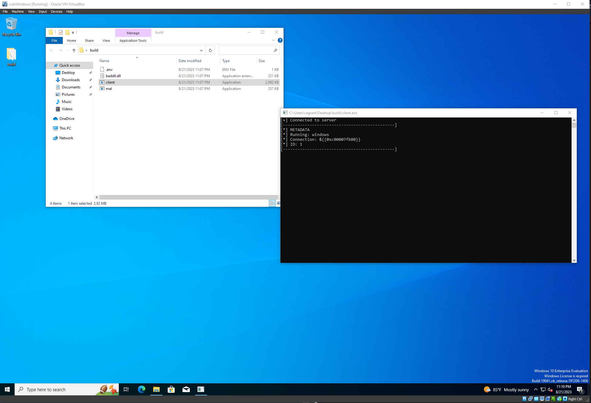

# win-dll-inj
Author: Giovanny Joseph

## About
This is a DLL injection that runs the a botnet client on the victims machine. This is a sloppy way to attach malware to a victim and it was only done as a proof of concept. Please do not use this to do any harm.

## Requirements
1. C++
2. GoLang
3. Make
4. VboxManage
5. Vagrant

## Usage

### Build the Virtual Machine
```sh
cd vmconfig
vagrant up
```

### Build the executables
#### NOTE: change the values for IPADDR and PORT in the makefile so that it is configured for your local environment. As well as the values in dllmain.cpp and main.cpp so that the file location is pointed toward where it is located in you current env.
```sh
make build
```

### Deploy the client side executables to the VM
```sh
make deploy
```

### Run the botnet server side
```sh
cd cmdCenter
./server.exe start -i
```
From here once a client connects you can interact with the botnet servers CLI to control the clients.

### Run the botnet client side
#### Method 1: Open the client application in the build directory on the desktop


#### Method 2: use the terminal to open the mal.exe and attach the client.exe execution as a thread of another application
```sh
./mal.exe (Get-process | ?{$_.ProcessName -eq "PROCESSAME"} | Select-Object -ExpandProperty Id)
```
(This only works on local machine not VM for now)
